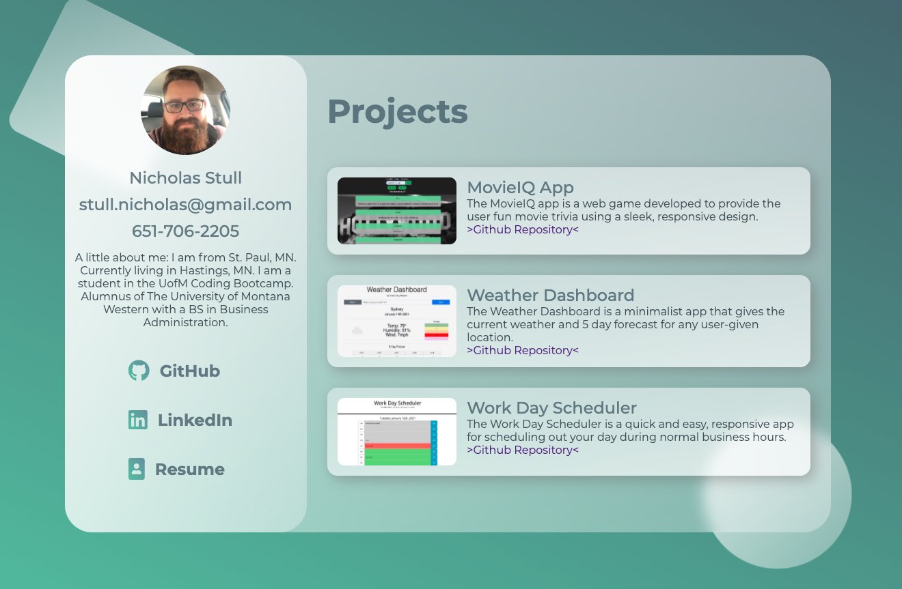
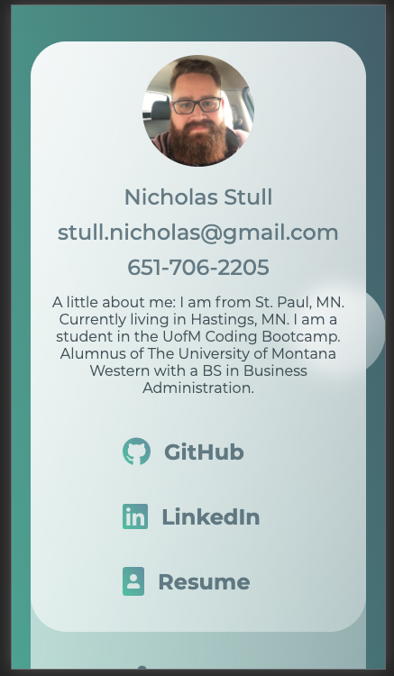
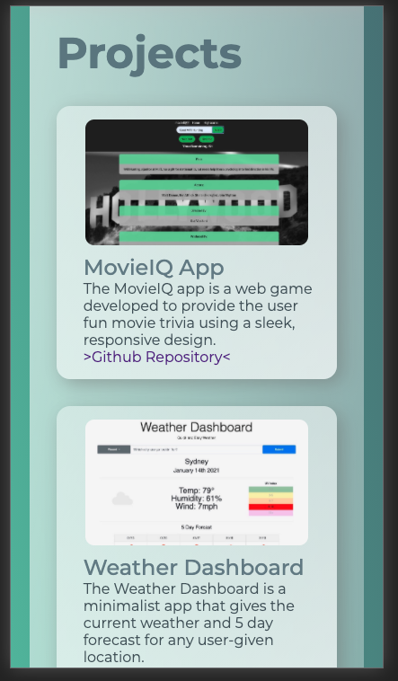

# Project1-Portfolio
This is a personal portfolio displaying information about me, contact information, links to my various accounts and resume, and a brief list of some of my current projects.

## Overview
While making this portfolio I wanted to best display my React and CSS capabilities. My goal was to make a clean one page design that was appealing to the eye, had a few bells and whistles (css animation), and I wanted it to be very responsive to screen size. I have a TON of information about myself in several areas including my GitHub profile, my LinkedIn, and my resume. I did not feel it necessary to copy and paste once again on my portfolio. I aimed to have it be concise and to the point with easy access to further information if needed with links to all of the above.

## Deployed Link

https://nickstull.github.io/Project1-Portfolio/

## Technologies Used

React and CSS

## Screenshots

## License

MIT License

## Contact

https://github.com/NickStull
